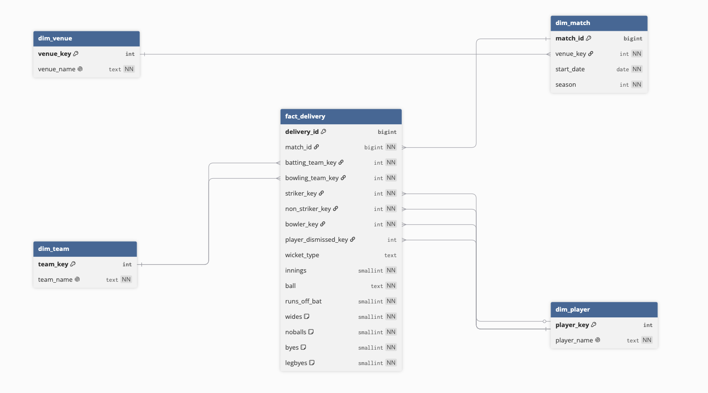

# IPL Ball-by-Ball Analytics (PostgreSQL)

A PostgreSQL analytics project built on **IPL ball-by-ball data** — roughly
**295,732 deliveries across 1,243 matches (2008–2026 seasons)**. Raw Cricsheet
CSV data is modelled into a star schema, loaded through a staging-and-transform
pipeline, and analysed with SQL: window functions, gaps-and-islands,
conditional aggregation, and a measured indexing pass. A small Python CLI sits
on top as an interactive player-lookup tool.

The analytical logic lives in **SQL**, not in application code. Python appears
only where it's the right tool: a bulk loader, and the parameterised lookup tool.

---

## Table of contents
- [Data source](#data-source)
- [Architecture](#architecture)
- [How to run](#how-to-run)
- [Queries](#queries)
- [Optimization](#optimization)
- [Limitations & assumptions](#limitations--assumptions)
- [Repository layout](#repository-layout)

---

## Data source

Data is from **[Cricsheet](https://cricsheet.org/)**, downloaded as the IPL
**CSV (Ashwin format)** file (`all_matches.csv`). Each row is one delivery, with
columns for the batting/bowling teams, striker, non-striker, bowler, runs off
the bat, and the individual extras.

Two quirks of the raw data that the pipeline handles:
- The `ball` column is `over.ball` notation with a **0-indexed** over (`0.1` is
  the first ball of the match), so it is stored raw and parsed at query time.
- Zero-valued extras are stored as **blank strings**, not `0`, so the transform
  converts blanks to `0` (`COALESCE(NULLIF(...), 0)`).

---

## Architecture

A **star schema**: one fact table at the grain of a single delivery, with four
dimensions.



- **`fact_delivery`** — one row per ball (~295k rows). Holds the measures
  (runs, extras) and foreign keys to every dimension.
- **`dim_player`**, **`dim_team`**, **`dim_venue`**, **`dim_match`** — the
  descriptive entities.

Key design decisions:

- **Grain first.** One row per delivery drives everything downstream.
- **Role-playing dimension.** `dim_player` is referenced by `fact_delivery`
  four times — striker, non-striker, bowler, and dismissed player — via four
  separate foreign keys into one table.
- **Surrogate vs. natural keys.** Dimensions use generated surrogate `_key`
  columns, except `dim_match`, which uses the Cricinfo `match_id` directly (it
  is already a clean, unique, stable natural key).
- **Venue snowflaked onto match.** Venue is an attribute of the *match*, not the
  *ball*, so `venue_key` lives on `dim_match` rather than being stamped onto
  every delivery.
- **Ratios are computed, not stored.** Only additive components (runs, legal
  balls) are stored; strike rate, economy, and average are derived at query
  time.
- **ELT, not ETL.** Python only bulk-loads raw CSV rows into a text-only
  `staging_deliveries` table; all cleaning and reshaping happens in SQL.

---

## How to run

```bash
# 1. Create the database and schema
createdb ipl
psql -d ipl -f sql/01_schema.sql

# 2. Load raw CSV into staging (place all_matches.csv in data/ first)
psql -d ipl -c "\copy staging_deliveries FROM 'data/all_matches.csv' WITH (FORMAT csv, HEADER true)"

# 3. Transform staging into the star schema (atomic, wrapped in a transaction)
psql -d ipl -f sql/03_transform.sql

# 4. Add the index used by selective queries
psql -d ipl -f sql/04_indexes.sql

# 5. Run any analytical query
psql -d ipl -f sql/queries/orange_cap.sql

# 6. (Optional) run the interactive player-profile tool
pip install -r requirements.txt
python scripts/player_profile.py
```

After loading, the pipeline reconciles exactly: `staging_deliveries` and
`fact_delivery` both hold **295,732** rows, and `dim_match` matches the
`COUNT(DISTINCT match_id)` in staging (1,243).

---

## Queries

Six analytical queries, each demonstrating a distinct technique. Example results
below were validated against public IPL records.

| Query | What it computes | Technique |
|---|---|---|
| `orange_cap.sql` | Top run-scorer per season | Window `RANK()` over a grouped aggregate |
| `phase_strike_rate.sql` | Batting strike rate by phase (powerplay / middle / death), overall and by season | Ball-string parsing, `CASE` bucketing, conditional counting |
| `death_over_economy.sql` | Bowling economy leaderboard for the death overs (16–20) | Conditional counting, domain-correct "runs conceded" and "legal ball" definitions, ranking + qualification threshold |
| `rolling_form.sql` | 5-innings rolling average of runs per batter | Window **frame** (`ROWS BETWEEN 4 PRECEDING AND CURRENT ROW`) |
| `dot_ball_streak.sql` | Longest streak of consecutive dot balls faced, per batter | **Gaps-and-islands** (difference of two row-number sequences) |
| `player_profile.sql` | Full career batting card for one player | Selective single-player lookup; parameterised; uses the index |

**Validation examples (all match public records):**
- *Orange Cap 2016:* V Kohli, **973 runs** (the real record).
- *Phase strike rates (all seasons):* powerplay ≈ **126.5**, middle ≈ **126.4**,
  death ≈ **157.6** — the expected "acceleration at the death" shape.
- *Player profile — V Kohli:* 277 innings, **9,346 runs**, highest **113**,
  average **40.8**, strike rate **134.9**, 847 fours, 317 sixes.

**Domain definitions that make the cricket correct:**
- *Runs conceded (bowler)* = `runs_off_bat + wides + noballs` — byes/leg-byes are
  not the bowler's fault.
- *Legal ball* = `wides = 0 AND noballs = 0` — both get re-bowled and don't count
  toward an over. (Distinct from *ball faced*, which excludes only wides.)
- *Phase* = powerplay overs 1–6, middle 7–15, death 16–20 (derived from the
  0-indexed over).

---

## Optimization

The `player_profile.sql` query filters to a single player (`striker_key = ?`),
which is **selective** — it needs a few thousand of ~295k rows. This is exactly
where an index helps. Measured with `EXPLAIN ANALYZE`, before and after adding
`idx_fact_striker ON fact_delivery (striker_key)`:

| | Fact-table access | Execution time |
|---|---|---|
| **Before** (no index) | Parallel Seq Scan — filter removes 96,202 rows | **~46.7 ms** |
| **After** (`idx_fact_striker`) | Bitmap Index Scan — jumps to 7,127 rows | **~24.5 ms** |

So the index roughly **halves** execution time by eliminating the full-table
scan; the remaining time is genuine aggregation work (the query's CTEs and
per-innings max), which no index can remove.

The nuance worth noting: the same index is **correctly ignored** by the
full-table aggregate queries (e.g. phase strike rate), which must read most of
the table anyway. A sequential scan is optimal when you need every row, and the
planner knows it. Indexes were added where measurement justified them, and
deliberately *not* added where they wouldn't help (e.g. `bowler_key`, since the
death-over query aggregates across all bowlers rather than filtering to one).

---

## Limitations & assumptions

Deliberate scope decisions and known data-quality caveats:

- **Season is derived from the match date** (calendar year of the first ball),
  not the source `season` label — the raw label had formatting inconsistencies
  (e.g. `2007/08`, and a spreadsheet-corrupted `07-Aug`). This relabels the
  2007/08 season as 2008.
- **Venue names have inconsistencies** across seasons (same ground under
  slightly different spellings), so the ~60 distinct venue strings represent
  fewer physical grounds. Not normalised.
- **Player names are searched by surname**, because Cricsheet stores names as
  `initial surname` (e.g. `V Kohli`), which doesn't match how users type them.
  A production version would use a name-alias/normalisation layer.
- **Super overs excluded** (`innings IN (1, 2)`) from phase, economy, and streak
  analysis, for simplicity.
- **Dot-ball streaks are scoped per innings** and count a "dot" as a faced ball
  with no run off the bat.
- **Dismissals count the striker only** — a run-out at the non-striker's end is
  not attributed, slightly undercounting some players' dismissals.
- **Rolling form is a simple average of runs per innings** — it does not account
  for not-outs or balls faced.
- **Fielding detail dropped** — `fielder_1/2/3`, `other_wicket_type`, and a few
  rare columns from the source are not modelled.

Listing these is deliberate: they document where the data's edges are and which
simplifications were chosen consciously.

---

## Repository layout

```
.
├── data/                        # all_matches.csv
├── sql/
│   ├── 01_schema.sql            # staging + star-schema DDL
│   ├── 02_load.sql              # \copy raw CSV into staging
│   ├── 03_transform.sql         # staging -> dimensions -> fact (atomic)
│   ├── 04_indexes.sql           # idx_fact_striker
│   └── queries/                 # the six analytical queries
├── scripts/
│   └── player_profile.py        # parameterised player-lookup CLI
├── docs/
│   └── schema_diagram.png       # ER diagram
└── README.md
└── requirements.txt
```

---

*Data © Cricsheet, used under the Open Data Commons Attribution License (ODC-BY).*